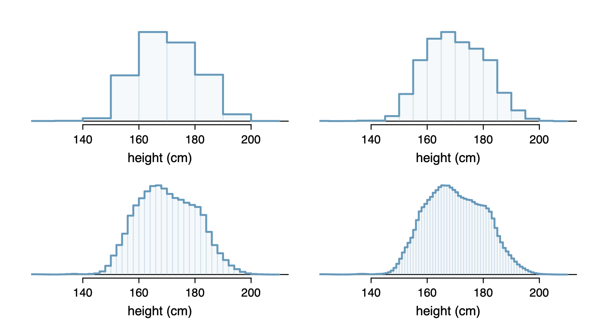
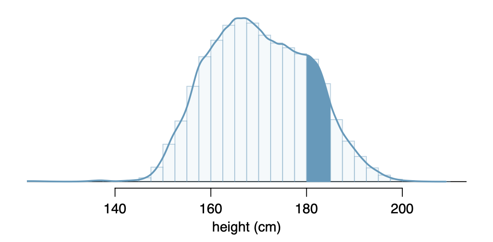

  
```{r global_options, include = FALSE}
library(knitr)
library(tidyverse)
knitr::opts_chunk$set(eval = TRUE, results = TRUE)
```

---
  
## Today's Agenda
- Random Variables
- Expected Value
- Uniform Distribution

---

## Random Variable

Add notes here


- eg. A student has an assigned text book for a course. How much a random student in the course spends on the text book is a random variable, $X$.
- random variables are usually denoted with capitals $X$,$Y$,$Z$
- The book store assumes that students will either: not buy a book, buy the book used, or buy it brand new. The possible outcomes are usually denoted with lower case letters.
- Revenue for the book store is $x_1 = 0$, $x_2 = 137$, $x_3 = 170$ for the three possbilities and the book store believes they each occur with probability $.20$, $.55$, and $.25$ respectively. In probability notation:

Add probability notation here


```{r}
books_data <- data.frame(prices = c("0","137","170"), probs = c(.2,.55,.25))
ggplot(books_data,aes(x=prices,y=probs)) + 
  geom_bar(stat="identity") +
  ylim(0,1) +
  labs(main="Proportion of students buying books at different prices")+
  ylab("Proportion")+ 
  xlab("Cost")
```

Another discrete probability distribution is that of rolling a die:

```{r}
die <-data.frame(roll=c(1,2,3,4,5,6),probs=c(1/6,1/6,1/6,1/6,1/6,1/6))

ggplot(die,aes(x=roll,y=probs))+geom_bar(stat="identity") +
  ylim(0,1) + 
  scale_x_discrete(name ="Roll", 
                    limits=c("1","2","3","4","5","6"))
```

- When all probabilities are equally likely the distribution is called the **uniform distribution**. 

- The expected value of a random variable with a uniform probability distribution is the mean of the possibilities


**Probability Distribution**

Add notes here

## Expected Value

The expected value of a random variable is:

$$E(X) = x_1 \times P(X=x_1) + \dots + x_k \times P(X=x_k) = \sum_{i=1}^k x_i P(X = x_i)$$

and the standard deviation of the expected value of the random variable is 

$$\sqrt{\sum (x_i-E(X))^2 P(X = x_i)}$$

If all the probabilities are the same, then 
$$E(X) = x_1 \times \frac{1}{k} + \dots + x_k \times \frac{1}{k} = \frac{\sum_{i=1}^k x_i}{k} = \bar{x}$$

this is just the mean.

eg. The expected price of a text book is:

```{r}

```


The standard deviation is:

```{r}

```

## Continuous Distributions
-   When data is numeric continuous, we can often make the bins of a histogram extremely small and still have a very readable graph

eg.



Add notes here



