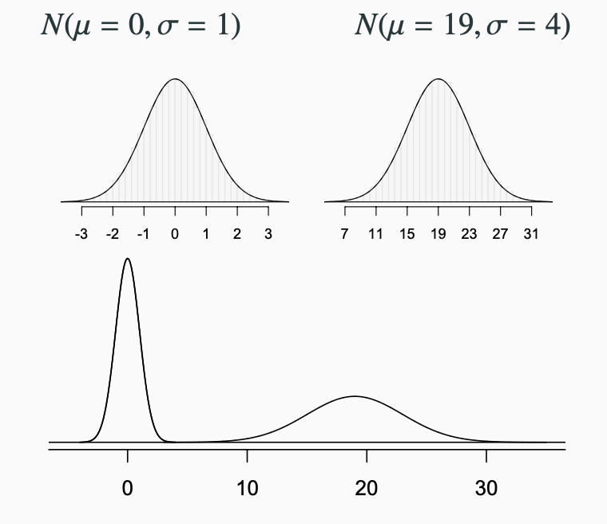

  
```{r global_options, include = FALSE}
library(knitr)
library(palmerpenguins)
library(tidyverse)
knitr::opts_chunk$set(eval = TRUE, results = TRUE)
```

---

## The Normal Distribution

Notes about normal distribution



### Finding areas

## Sampling distribution

```{r}
# fake data with some very tall people
fake_data <- data.frame("height" = 57+50*(rbeta(10000,3,10)))
ggplot(fake_data, aes(x=height))+geom_histogram(binwidth = 1)
```


```{r}
# fake data with some very tall people
# suppose this is the population of interest
mean_height <- mean(fake_data$height)
sd_height <- sd(fake_data$height)
```

```{r}
samp_1 <- sample(fake_data$height,50,replace=TRUE)
```

```{r}
mean(samp_1)
```

```{r}
samp_2 <- sample(fake_data$height,50,replace=TRUE)
```

```{r}
mean(samp_2)
```

## Sampling Distribution

```{r}
sampling_dist <- data.frame(samp_mean = replicate(10000, mean(sample(sample(fake_data$height,50,replace=TRUE)))))
ggplot(sampling_dist, aes(x=samp_mean))+geom_histogram(binwidth = .2)
```