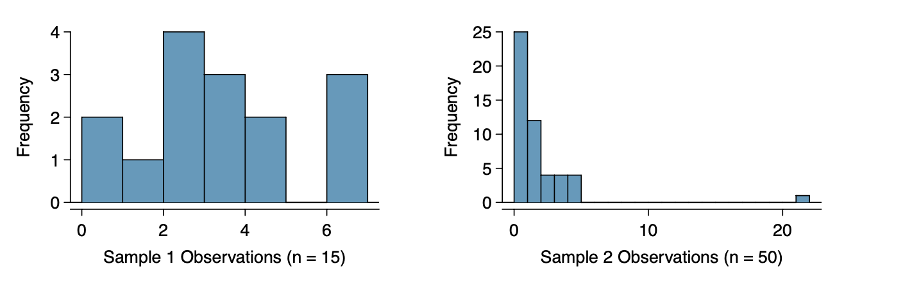

  
```{r global_options, include = FALSE}
library(knitr)
library(palmerpenguins)
library(tidyverse)
knitr::opts_chunk$set(eval = TRUE, results = TRUE)
```

---

## The Central Limit Theorem

Notes about Central Limit Theorem

### Conditions for Using CLT for means




## CLT for means 

Notes about notation, barX, mu, ... 

$$\bar{X} \sim N \left(\mu,\frac{\sigma}{\sqrt{n}} \right)$$

Example: Suppose that the population mean is $5$ and the population standard deviation is $12$. What is the probability that a simple random sample of size $36$ will have a sample mean greater than $7$?

Activity: 

1. A population has mean $\mu = 143$ and standard deviation $\sigma = 15$. Describe the sampling distribution for a sample of size $150$. Draw a picture of the sampling distribution. Label the area corresponding to the probability of a sample mean greater than $144$. Find the probability.


2. A population has mean $\mu = 22$ and standard deviation $\sigma = 1.4$. What is the standard error if the sample size is $50$. How many standard errors away from the population mean is a sample mean of $\bar{X} = 23$? Find the probability that a sample mean of size $50$ has mean less than 23.


3. A population has mean $\mu = 22$ and standard deviation $\sigma = 1.4$. You plan to take a sample of $50$ observations. Find a the $2.5$ percentile and the $97.5$ percentile of the sampling distribution for the sample mean.


