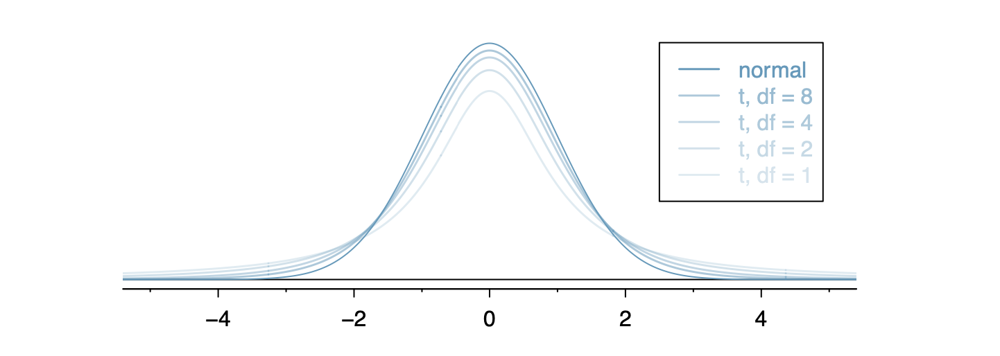

  
```{r global_options, include = FALSE}
library(knitr)
library(tidyverse)
knitr::opts_chunk$set(eval = TRUE, results = TRUE)
```

---

## Population Proportion Conditions

+ Independence: Simple random sample
+ Success-Failure: 


Insurance companies are interested in knowing the population percent of drivers who always buckle up before riding in a car. 

1. When designing a study to determine this population proportion, what is the minimum number you would need to survey to be $95 \%$ confident that the population proportion is estimated to within $0.03$?

2. If it were later determined that it was important to be more than $95 \%$ confident and a new survey was commissioned, how would that affect the minimum number you would need to survey? Explain your reasoning?

3. Suppose that the insurance companies did do a survey. They randomly surveyed $400$ drivers and found that $320$ claimed they always buckle up. We are interested in the population proportion of drivers who claim they always buckle up.

4. Explain why the conditions for inference are satisfied.

5. Construct a $95\%$ confidence interval and state your results within the context of the problem.


## Unkown Population Stanard deviation

+ Recall that we use $s$ to denote the sample standard deviation.

$$T\text{-score} = \frac{\text{observation}-\text{expected}}{s}$$



6. Consider a population that is approximately normally distributed with unknown population mean and unknown population standard deviation. A simple random sample of $16$ observations has a sample mean of $\bar{X}=62$ and standard deviation of $52$. Find a $95 \%$ confidence interval for the population mean. 

```{r}
# Still need normality and independence conditions.

```
