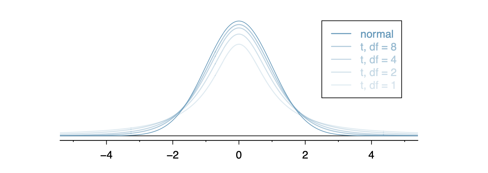

  
```{r global_options, include = FALSE}
library(knitr)
library(tidyverse)
knitr::opts_chunk$set(eval = TRUE, results = TRUE)
```

---

## Unkown Population Stanard deviation

+ There is a more general equation of a t-score but the version specific to out purposes will be the following:

Given a normally distributed population with mean $\mu$, then for a sample of size $n$, the $t$-scores are:

$$t\text{-score} = \frac{\bar{x}-\mu}{s/\sqrt{n}}$$

and will follow a $t$-distribution with degrees of freedom $n-1$. Said more concisely: 

$$\left(\frac{\bar{x}-\mu}{s/\sqrt{n}} \right) \sim t(n-1)$$





1. Find the $T$-scores corresponding to middle $95 \%$ on a t-distribution with $15$ degrees of freedom.

```{r}

```


2. Consider a population that is approximately normally distributed with unknown population mean and unknown population standard deviation. A simple random sample of $16$ observations has a sample mean of $\bar{X}=62$ and standard deviation of $52$. Find a $95 \%$ confidence interval for the population mean. 

```{r}
# Still need normality and independence conditions.


```

3. We will identify a confidence interval for the average mercury content in dolphin muscle using a sample of 19 dolphins from the Taiji area in Japan. The data are summarized below. The minimum and maximum observed values can be used to evaluate whether or not there are clear outliers.

| $n$ | $\bar{x}$ | $s$ | min. | max |
|:--:|:--:|:--:|:--:|:--:|
|19|4.4|2.3|1.7|9.2|

Construct a 95% confidence interval.

```{r}

```

4. $\bar{x} = 20, n = 36, s = 3, \alpha= .05 $

5. $\bar{x} = 50, n = 16, s = 5, \alpha =.01 $

6. In each part decide whether the appropriate method for
obtaining the confidence interval is with $z$-scores, $t$-scores, or neither.

+ A random sample of size $17$ is taken from a population very near normal. The population standard deviation is unknown.

+ A random sample of size $50$ is taken from a population that is roughly normal but has some outliers. The population standard deviation is known.

+ A random sample of size $15$ is taken from a population. There are known to be a few outliers but otherwise is a pretty normal population. The population standard deviation is known.